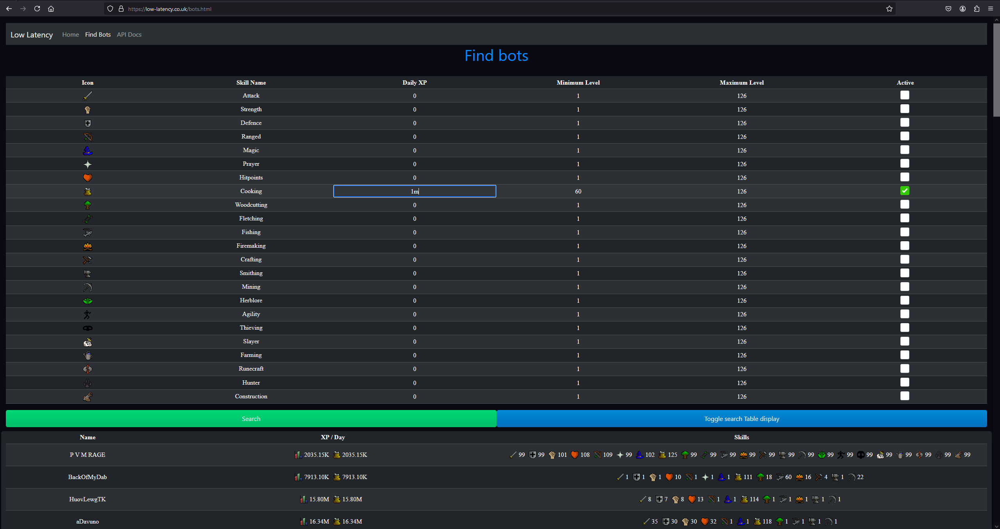
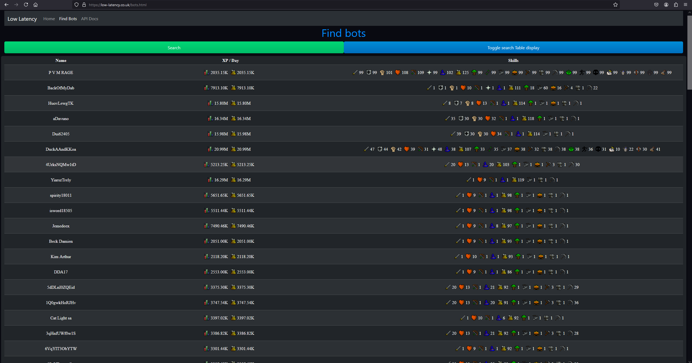

# Low Latency

## About

Low Latency is a website tool used to track players in Old School Runescape, The name refers to the low latency between a player entering the Hiscores and being tracked in the database.

Ironically the latency between the Online website https://low-latency.co.uk is much greater than the local development database. Website at its current stage is just a showcase of the capabilities of the project.


## What can it do?

The database tracks players experience and how much they have gained in the past week, The top XP earners are all compared to eachother and links are created. Only accounts with 50+ similar active players are available in the searchable website.




- The Daily XP filter is currently only available for one skill at a time.
- You can type ```100k``` or ```1m``` and it will recognise this as an integer.
- You must then tick the active box to start filtering by this skill.


- You will only see the top 100 Players for the search results
  - Therefore if you want to filter further:
    - You can tick more skills and set ranges for levels


The search filter table can also be hidden with the Blue button ```Toggle search table display```.





## What languages is the project made in?

### Go
- The scraper is written in Go for performance in web requests and high concurrency.
- The similarity task runs in Go.
- The site API's and backend is all in Go.

### Front end
- Front end uses a mix of html/css/js & Bootstrap

### Database
- The database uses PostgreSQL.